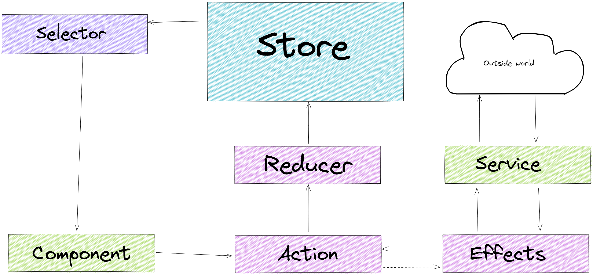

# State management with Angular and NgRx

There is a saying:

> If you think that state management is easy, then think how many times you have fixed a problem by turning your computer off and on again.

This is a problem that we were facing with our previous Angular user interface to our platform.

We had a lot of data floating around, data that was needed in many different components and in many different combinations.

Previously this problem was solved by use of a "context" object. An object that contains ***everything*** needed for the application, and was injected into almost every component that we used. And as it was strongly typed it made testing those components a nightmare! Because to inject the test object it needed to be complete. [@GeePawHill](https://twitter.com/GeePawHill) on Twitter talks about awkward tests. These were super awkward!

As well as this context object making it difficult to do any kind of automatic checks - meaning that every change needed complete manual regression testing to be sure that nothing had broken, the data inside of the object had no protection. That meant that anyway it was used could also update the data.

So... No only did we not have automatic checks in place, but every single component could damage every single piece of data - ***and no one would know***

It was not, as you say, ideal...

## Rewrite

Our old application had several issues, this was just one. And in 2020 we took the decision to rewrite it from the ground up. Both the back end services as well as the front end application. It was a risky decision, but we felt that it was the right one.

When looking at the front end application, we knew that we had to change the way we managed our state if we wanted the new application to be sustainable and maintainable over time.

We needed a way to ensure:

* Each component had access **only** to the data it needed
* That this data could be centrally stored and managed
* The data could be easily, and reliably used inside of those components
* That the components could not directly alter the data that they were using from the store

## Enter the Redux Pattern with NgRx

We decided that the best way to go forward was to use the Redux pattern with NgRx. The learning curve was a bit steep, but if used correctly it would solve th problems that we had.

So what is redux? Put simply, it is a library that allows us to manage our state in one location for each of our modules.

The state is split into 5 parts:

* Store: A central location for all of our state. It is the only place where we can access the state.
* Selector: Functions that return a small slice of the state
* Actions: Functions we can call to change the state
* Reducers: Functions that tale the current state, an action, and  return a new state
* Effects: Functions that are called when an action is dispatched to communicate with the outside world via services

The state is a bit of an oxymoron. It is both one single store, and split into modules that only know about the part of the state they have responsibility for - ensuring that each module has responsibility for it's own data, and never changes another modules data.

By using selectors we allow access to only that part of the state that is needed. This means that we are never accessing the entire state, in a random way, in our components.

As the state cannot be updated directly, but rather you need to use actions, effects and reducers in order to do so means that we also have greater control over **how** and **when** the state changes. A component cannot simply update a random part of the state - but instead has to call an action that will cause it to be updated.

All of these make testing much simpler and less awkward. We can mock our state, and ensure that when we have a known data state a component will behave in a certain way. 

We can test that actions and effects will update the state as we want, and that the outcome if what we expect. And we can test that selectors will return just the small slice that we need.

When we expect a component to update the state we only need to test that the action is fired correctly, not that the state is updated. What that action does is not the concern of the component, and so it does not need to be tested with the component.

This is all an order of magnitude simpler than the previous state management.

## Learning Curve

As mentioned previously, iff there is a downside to using the Redux pattern with NgRx, it is that is more complex to use and learn. The learning curve was very steep for our developers - having previously had no experience using it. The back end developers that do not interact with it daily need assistance to ensure that they are using it correctly.

We went through iterations organizing our state across modules as we were learning how to use it. It caused some rework, but even with that rework it was simpler than the previous context object (which starts life really simple, and gets very complex, very quickly 😅).

We are still learning the best way to use NgRx to manage our state, but we also have a far better application because of it than we had before!

## Further Reading

If you want to look into Redux and NgRx for yourself here are some interesting articles to dive deeper!

* [Redux JS](https://redux.js.org/introduction/core-concepts)
* [NgRx documentaton](https://ngrx.io/docs)
