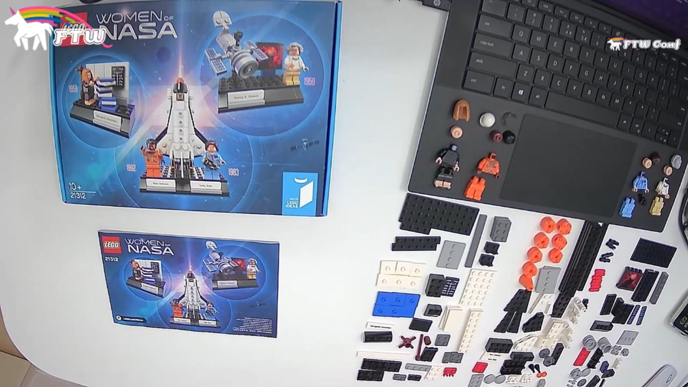

I'm always amazed at the people who live code on Twitch. Not only because they are simply amazing, but also because of what it takes to put yourself out there to actually do it.

It's something I've wanted to add to my list of hobbies for a while, but never quite managed to. Fear always caught me in the end!

Until... Earlier this year I was asked to write a [talk](https://www.ftwconf.com/creative/lego-in-lockdown/) based around my love for Lego for the FTW Conference, to be given on International Women's Day.

I wrote the talk, but though that what would really make it amazing would be to build a set whilst I was giving the talk. Because why not try to give a talk for the first time, and at the same time see if I can concentrate enough to actually follow instructions at the same time!

I got a wonderful idea about what to build through the Lego WhatsApp group that I'm in - why not build the Women of Nasa set! What better to combine the love of Lego as an Adult Fan of Lego (AFOL) with International Women's Day.

I hunted the set down (it's out of production and so I had to find a seller!), and got it on.

Then I had to figure out *how* I was going to build? And how I was going to build, talk and show a presentation all at the same time. Maybe I hadn't thought this through!

But with the the help of some friends I got it sorted!

## Equipment - Basic

From streaming talks I'd already managed to build up a decent studio for giving talks. Not travelling, going out for meals etc. meant that I had some slush fund to get the setup I wanted.

* Camera: Sony A6400 with a Sony E PZ 18-105mm f/4 G OSS lens (I actually bought this to replace my Canon 5D that I'd had for more than a decade. But it was also perfect for use here)
* Microphone: Samson SE50, connected to a DBX 286S mic amp, connected to a Scarlet 2i2 audio interface (Yes, I went over the top)
* Two umbrella lights, and two soft-boxes and a green screen (the soft-boxes and green screen still need setting up) from [vidaxl](vidaxl.nl)
* Various stands for the camera

Add to this OBS (from which I think I use the absolute bear minimum of functionality) and I had a really great setup for giving talks.

## Equipment - Lego in Lock-down talk

But of course, that was not going to work for the Lego talk because... I needed an extra camera!

Thankfully I gave a talk at [All Day DevOps](https://www.alldaydevops.com/) last year and the speaker gift was designed to help you give an awesome presentation. A HD webcam was included for that 😊

Awesome, now I just need to mount it... I had a GorillaPod lying around (I used it for the A6400 when I needed a small tripod), which I could attach to the webcam, and hang (precariously) from the portrait monitor. It fell a couple of times, but I got it there in the end!

The view it gave was not perfect, but hey, it worked!

